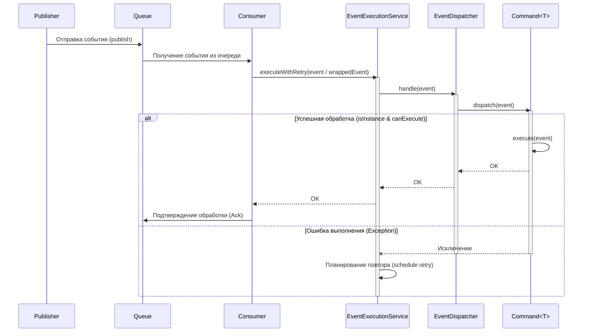

# Работа с событиями

## Основные компоненты
### События

Все события должны быть реализацией интерфейса [`Event`](../../dispatcher/Event.java). Требование наследования Serializable гарантирует возможность передавать события между очередями.
При желании впоследствии они также могут быть упакованы в [`EventWrapper`](../../dispatcher/EventWrapper.java) для поддержки повторных попыток обработки и задержки между ними.

Пример реализации — [`ExampleEvent`](ExampleEvent.java).

### Команды

Должны являться реализацией [`Command<T>`](../../dispatcher/Command.java), где `T` — класс конкретного события, на которое будет реагировать команда. Если у класса есть наследники, команда будет обрабатывать и их тоже.

У команд задан дефолтный метод `dispatch(event)` который проверяет, может ли команда обработать переданное событие по двум критериям: соответствует ли тип события обрабатываемому командой и если да, то выполняются ли дополнительные условия срабатывания. 

Пример реализации — [`ExampleCommand`](ExampleCommand.java).

### Производитель-Потребитель

**Производитель** реализует интерфейс [`EventPublisher`](../../dispatcher/EventPublisher.java) с единственным методом `publish(event)`. 

Интерфейсы для **очереди** и **потребителя** не заданы, т.к. при различных подходах используются разные инструменты (in-memory, Redis, брокеры и т.д.).

Для примера приведена [in-memory реализация](./in_memory/) (включена по умолчанию). Здесь же находится **EventExecutionService**, который берет на себя работу с событиями, которые не удалось обработать (планирует их повторное выполнение с заданной задержкой и счетчиком повторов).

### Диспетчер событий

Распределением событий по командам занимается [`EventDispatcher`](../../dispatcher/EventDispatcher.java). При инициализации Spring внедряет в него все зарегистрированные бины команд. Диспетчер при вызове метода `handle(T event)` итерируется по всем известным командам и делегирует им вызов `dispatch(...)`.

---

Для демонстрации работы создан [`CommandLinePublisher`](./CommandLinePublisher.java), который при запуске приложения создаёт два события `ExampleEvent`.

---

## Схема взаимодействия компонентов

